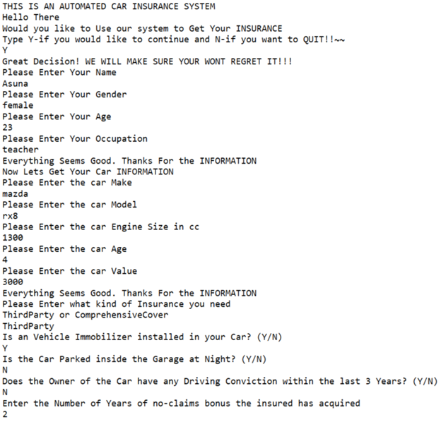
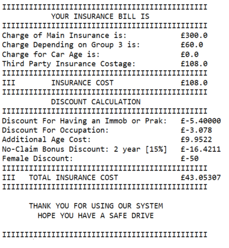
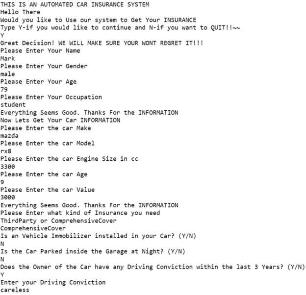
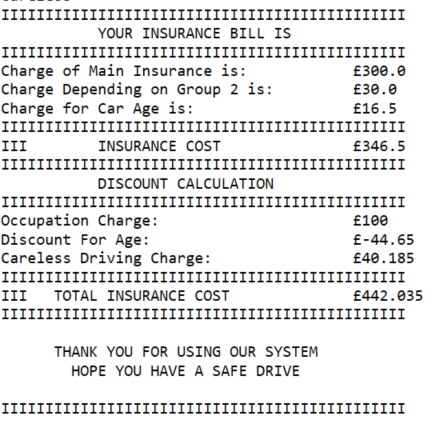

# AI Car Insurance using CLIPS
To implement an expert system to determine the cost of insuring a car. The overall cost is determined by a collection of rules dealing with type and age of car, age of the insured, place of residence etc

# <h3> These are the following questions the system will ask and depending on the reply it calculates the Total insurance cost.
# <h3> Information 1

  
# <h3> Output

  
# <h3> Information 2

  
# <h3> Output

